# Architecture

The repository demonstrates a clean separation of delivery responsibilities.

```mermaid
flowchart LR
  Dev[Developer] --> PR[GitHub Pull Request]
  PR --> CI[GitHub Actions validation]
  CI --> Main[main branch]
  Main --> Release[Release image workflow]
  Release --> Harbor[Harbor image repository]
  Harbor --> Digest[Immutable image digest]
  Digest --> Promotion[Promotion PR]
  Promotion --> GitOps[GitOps overlay]
  GitOps --> Argo[Argo CD]
  Argo --> K8s[Kind Kubernetes cluster]
  K8s --> Lens[Lens and kubectl]
```

## CI Responsibilities

GitHub Actions validates source code, runs tests, builds the container, scans the final image, publishes to Harbor, and creates or supports a GitOps promotion change. CI does not connect to the cluster.

## Harbor Responsibilities

Harbor stores the release artifact. The training flow uses a commit-SHA tag for traceability and a digest for deployment immutability. The CI robot account pushes images. A separate cluster pull credential is used by Kubernetes.

## GitOps Responsibilities

Git stores desired runtime state. The Kustomize overlay records the image digest and environment-specific configuration. A promotion pull request makes deployment a reviewable Git change.

## Argo CD Responsibilities

Argo CD runs in the cluster and pulls desired state from Git. It compares desired state with actual state, shows sync and health, applies changes, prunes removed resources, and self-heals selected drift.

## Kubernetes Runtime Responsibilities

Kubernetes schedules pods, creates ReplicaSets, checks readiness and liveness, exposes the Service, enforces security context, applies NetworkPolicy where supported, and records events for diagnosis.

## Trust Boundaries

| Boundary | Rule |
|---|---|
| Developer to GitHub | Changes enter through pull requests |
| GitHub Actions to Harbor | CI can push images using a robot account |
| GitHub Actions to Kubernetes | No direct cluster access |
| Argo CD to GitHub | Argo CD reads desired state |
| Kubernetes to Harbor | Cluster pulls images using a separate pull secret |

## Why CI Does Not Access The Cluster

CI is a build and publication system. Giving it cluster credentials creates a broad blast radius and hides deployment state inside transient jobs. In this lab, CI updates Git desired state; Argo CD performs reconciliation.

## Why Argo CD Pulls From Git

Pull-based GitOps makes the cluster responsible for matching Git. The current state, intended state, and drift are visible in Argo CD and recoverable through Git history.

## Why Image Digests Matter

Tags can be moved. Digests identify exact image content. Deploying by digest ensures the pods run the same artifact that CI built, scanned, and published.

